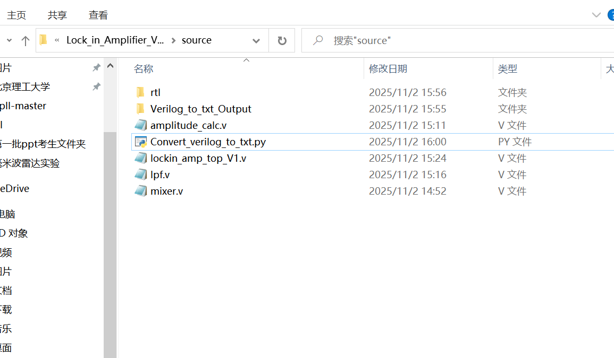
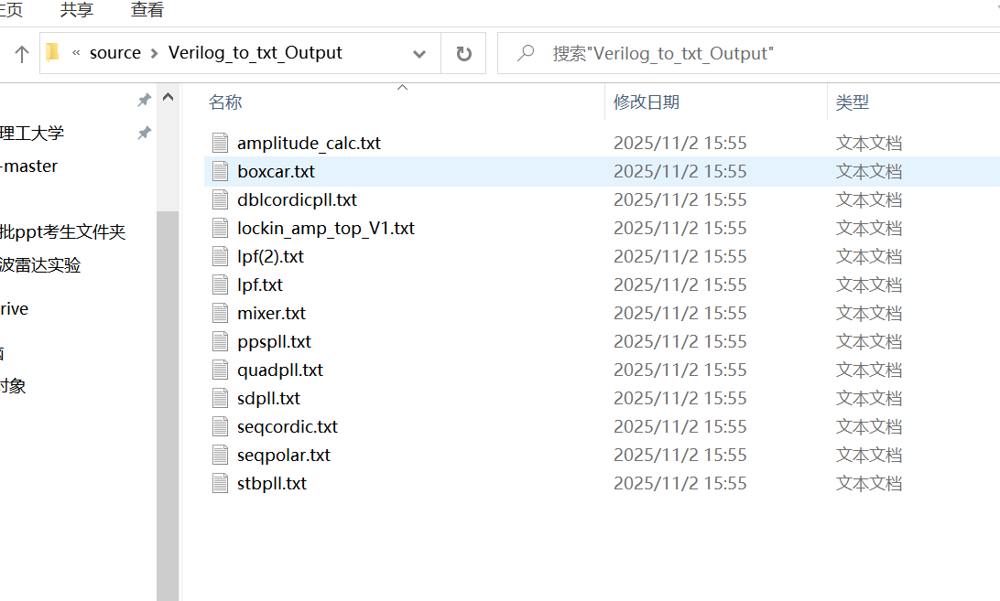

### 这是一个批量把.v文件转换为.txt文件的小工具，方便喂给不支持.v文件的LLM，可以运行python文件或直接下载exe文件双击运行。详情请见README文件。

#### This is a small utility that batch converts .v files into .txt files, making it easier to feed them into LLMs that don’t support .v format. You can either run the Python script or simply download the .exe file and double‑click to run it. For more details, please refer to the README file.
( Sorry I'm lazy to translate the README. At first, I planned to use AI to do the translation job, but I think it's can be done for everyone with preferred translation tools or LLMs they like. So if you need, please translate the README below.)

And this is my first try to push my first scripts to Github, although the codes are pretty simple. Hope I can gain a lot and contribute a lot here( HaHa I kown it's almost impossible for me, but I still hope what I upload to Github will find someone who needs it too )

---

### 使用方法
1. **(Recommended)** 把这个Convert_verilog_to_txt_V1_3.py程序放在一个地方，直接双击运行（前提是得装了python环境，不需要任何第三方库，我用的3.8没问题，应该更新的版本也行）
2. 下载exe文件，就把它跟.py一样用就行，直接双击运行。

它会把py文件同层的所有.v文件和同层的文件夹以及其子文件夹内的所有.v文件全部转化为.txt文件

输出文件夹的名字前面会加上当前py文件层级的前两级父文件夹，比如文件结构是 
```
NUECSDC_Proficiency_Test_2024_1_V1.srcs
├── Convert_verilog_to_txt_V1_3.py (I---A---M---H---E---R---E
!)
├── NUECSDC_Proficiency_Test_2024_1_V1_NUECSDC_Proficiency_Test_2024_1_V1.srcs_Verilog_to_txt_Output
│   ├── ...result.txt
├── game_count_test.v
├── game_count_V1.txt
├── game_count_V2_wrong.txt
├── sources_1
│   ├── counter10.v
│   ├── counter24.v
│   ├── counter6.v
│   ├── counter60.v
│   ├── digital_clock.v
│   ├── digital_clock_tb.v
│   ├── digital_tube_display.v
│   └── new
│       ├── counter12.v
│       └── top.v
└── sim_1
    └── new
        └── top_tb.v
```
如果运行Convert_verilog_to_txt_V1_3.py文件，那么上面展示的所有的.v文件都会被转化为.txt文件，放到NUECSDC_Proficiency_Test_2024_1_V1_NUECSDC_Proficiency_Test_2024_1_V1.srcs_Verilog_to_txt_Output文件夹里。默认保留原目录结构。


那么输出文件夹的名字就是
```
aaa_bbb_Verilog_to_txt_Output
```
如果不足两级父文件夹，那就只加第一级父文件夹，如
```
bbb_Verilog_to_txt_Output
```
如果没有父文件夹，那就只有
```
Verilog_to_txt_Output
```

PRESERVE_STRUCTURE控制是否保留原有目录结构
 True  -> 保留目录层级
 False -> 所有文件平铺在目标文件夹中
默认是 PRESERVE_STRUCTURE = True

比如把.py文件放在这里


PRESERVE_STRUCTURE = False转化后就是


这样可以方便多个文件传输给AI

同名文件会在后面加序号(2)(3) 
每次运行都会删除原先的输出文件夹，再重新转化
即使没有任何文件被转换，也会生成一个空的文件夹。

exe文件由pyinstaller打包而成。

所有代码均有AI生成，但我已经验证过使用到现在没发现问题。


